# Chapter 10 Ack/Nak Protocol // Ack/Nak协议

## 关于前一章

在上一章中，我们描述了数据链路层数据包（DLLP）。我们描述了DLLP类型的使用、格式和定义及其相关字段的详细信息。DLLP用于支持Ack/Nak协议、电源管理、流量控制机制，以及可用于供应商自己定义的目的。

## 关于本章

本章描述了数据链路层的一个关键特性：它是用于保证TLP在链路上传输可靠的，一种基于硬件的自动机制。Ack DLLP确认TLP的成功接收，而Nak DLLP指示传输错误。本章将描述在未检测到TLP或DLLP错误时的正常运作规则，以及在TLP和DLLP出现错误时的错误恢复机制。

## 关于下一章

下一章将介绍物理层的逻辑子块，它为串行传输和接收数据包做准备。完成这一过程需要几个步骤，下一章将详细介绍这些步骤。下一章涵盖了使用8b/10b编码的前两个PCIe规范版本Gen1和Gen2相关的逻辑。Gen3的逻辑不使用8b/10b编码，在“物理层逻辑（Gen3）”一章中单独描述。

## 10.1 目标：可靠的TLP传输

数据链路层（如图10-1所示）的功能是确保TLP的可靠传输。该规范要求BER（比特错误率）不低于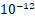，但错误仍然会经常发生造成麻烦，单个比特错误会破坏整个数据包。随着新一代链路速率的不断提高，这个问题只会变得更加明显。

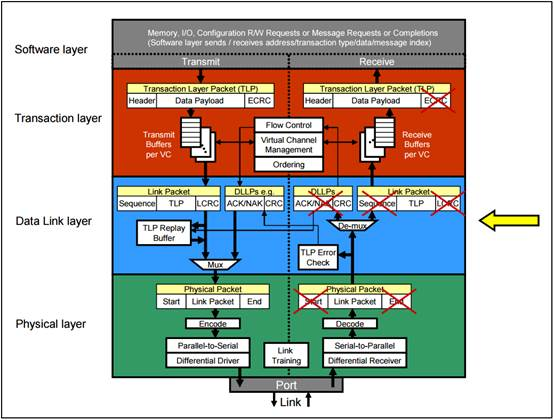

图10-1 数据链路层

为了实现这一目标，每个TLP都添加了一个称为LCRC（Link Cyclic Redundancy Code，链路循环冗余码）的错误检测码。错误检查的第一步是简单地验证LCRC在接收方是否仍然正确。如果每个数据包都有一个唯一的递增序列号，那么在已发送的多个数据包中，很容易找出哪个数据包遇到了错误。使用该序列号，我们还可以要求TLP必须按照发送顺序成功接收。这个简单的规则使得在接收方的数据链路层检测丢失的TLP变得容易。

图10-2更详细地显示了与Ack/Nak协议相关的数据链路层中的基本块。接收方通过评估数据包中的LCRC（首先检查）和序列号（第二个检查）来检查通过链路发送的每个TLP。接收设备通过返回Ack来通知发送设备已经接收到完好的TLP。在发送方接收到Ack意味着接收方已成功接收到至少一个TLP。另一方面，发送方接收到Nak表示接收方错误地接收到了至少一个TLP。在这种情况下，发送方将重新发送适当的TLP，希望这次重发能得到更好的结果。这种做法是明智的，因为导致传输错误的事情可能是瞬态事件，重发很有可能解决问题。

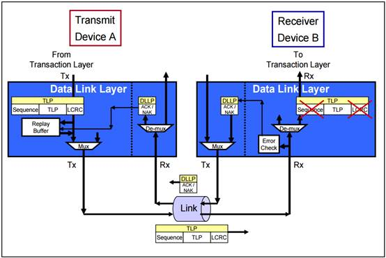

图10-2 Ack/Nak协议概述

由于协议中的发送和接收设备都有发送端和接收端，因此本章将使用以下术语：

- 发送方（Transmitter）是指发送TLP的设备

- 接收方（Receiver）是指接收TLP的设备

## 10.2 Ack/Nak协议的要素

数据链路层的主要Ack/Nak协议要素如图10-3所示。不过，一次考虑的事情太多了，所以让我们从只关注发送方要素开始，这些要素在图10-4的大图中显示。

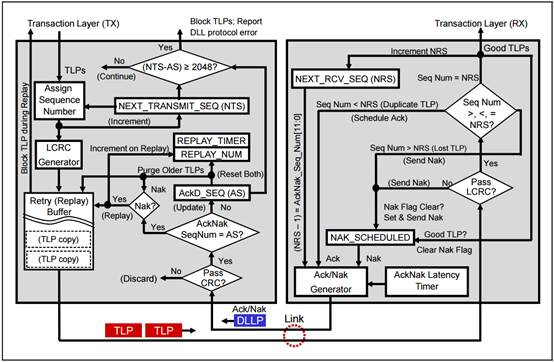

图10-3 Ack/Nak协议的要素

### 10.2.1 发送方要素

当TLP从事务层（Transaction Layer）到达时，有几项工作要做，以便在接收方上进行稳健的错误检测。如图所示，TLP首先被分配下一个序列号，该序列号由12位NTS（NEXT_TRANSMIT_SEQ）计数器获得。

#### *10.2.1.1 NEXT_TRANSMIT_SEQ计数器*

NTS计数器生成下一个传入TLP的序列号（Sequence Number）。它是一个12位计数器，在复位或链路层报告DL_Down（链路层处于非活动状态）时初始化为0。由于它随着TLP的进入不断递增，因此计数器最终会达到最大值4095，并在继续计数的过程中翻转为0。

分配给TLP的序列号将在接收方发回的Ack或Nak中使用，以便在重传Buffer中引用该TLP。人们可能会认为，如此大的计数器意味着可能有大量未确认的TLP在传输途中，但实际上这种可能性很小。主要原因是，接收方需要在一定时间内为成功接收的TLP发送回执（Ack）。这一时间在“AckNak_LATENCY_TIMER”中详细讨论，但这一时间通常只够传输几个最大大小的数据包。

#### *10.2.1.2 LCRC发生器*

这部分电路根据要发送的数据头（header）和数据（data）生成一个32位CRC（Cyclic Redundancy Check，循环冗余校验）码，并将其添加到发送数据包的末尾，以方便错误检测。该名称源于这样一个事实，即这种校验码（Check code,根据要发送的数据包计算）是冗余的（Redundant,不增加任何信息），是从循环码（Cyclic codes）中衍生出来的。虽然CRC无法像ECC（纠错码）方法那样为接收方提供足够的信息来进行自动纠错，但它确实提供了强大的错误检测功能。CRC通常用于串行传输，因为它们易于在硬件中实现，而且善于检测突发错误（一连串的错误比特）。由于串行设计比并行设计更容易出现这种情况，这就解释了为什么CRC是串行传输中错误检测的最佳选择。CRC码使用TLP中所有字段计算，包括序列号。接收方将进行同样的计算，并将计算结果与TLP中的LCRC字段进行比较。如果两者不匹配，接收方的链路层就会检测出错误。

#### *10.2.1.3* *重传Buffer*

重传Buffer（replay/retry buffer）按发送顺序存储TLP，包括序列号和LCRC。当发送方收到表示TLP已成功到达接收方的Ack时，它会从重传Buffer中清除那些序列号等于或早于Ack编号的TLP。这样，设计允许一个Ack代表多个成功的TLP（译注：详见10.2.2.3序列号检查章节），从而减少了必须发送的 Ack数量。由于数据包必须始终按顺序查看，因此如果收到的Ack的序列号为7，那么不仅 TLP 7已成功接收，而且在它之前的所有数据包也一定已成功接收，因此没有理由在重传Buffer中保留这些数据包的副本。

如果接收到Nak，Nak中的序列号仍表示最后收到的完好数据包。因此，即使收到一个Nak，也会导致发送方清除重传Buffer中的TLP。但是，由于它是一个Nak，这意味着接收方没有成功接收到某些内容，因此在清除所有已确认的TLP后，发送方必须按顺序重新发送重传Buffer中的所有内容。例如，如果接收到一个序列号为9的Nak，那么数据包9和所有之前的数据包都会从重传Buffer中清除，因为接收方确认它们已被成功接收。但是，由于它是一个Nak，发送方必须从数据包10开始，依次重新发送重传Buffer中的所有剩余TLP。

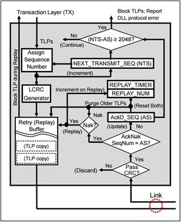

图10-4 Ack/Nak协议相关的发送方元素

#### *10.2.1.4 REPLAY_TIMER计时器*

REPLAY_TIMER计时器实际上是一个看门狗定时器。它确保发送方在规定时间内接收到已发送TLP返回的Ack/Nak数据包。如果该计时器超时，就意味着发送方发送了一个或多个 TLP，但在预期时间内没有收到确认。解决方法是重新发送重传Buffer中的所有内容，并重新启动REPLAY_TIMER。

在TLP已发送但尚未收到确认的时候，该计时器都在运行。如果REPLAY_TIMER当前未运行，则会在传输任何TLP的最后一个符号时启动。如果计时器已在运行，则发送额外的TLP不会重置计时器值。当收到确认重传Buffer中TLP的Ack或Nak时，计时器会重置为0，如果重传Buffer中仍有TLP（已发送但尚未确认的TLP），计时器会立即重新开始计数。但是，如果收到确认重传Buffer中最后一个TLP的Ack，即重传Buffer现在为空，则REPLAY_TIMER复位为0并且不进行计数。直到传输下一个TLP的最后一个符号后，才会重新开始计数。

#### *10.2.1.5 REPLAY_NUM计数器*

这个2位计数器跟踪接收到 Nak 或 REPLAY_TIMER 超时后的重新发送的尝试次数。当 REPLAY_NUM计数从11b翻转到00b（表明发送同一组TLP的4次尝试失败）时，数据链路层会自动强制物理层重新训练链路（LTSSM 进入Recovery，恢复状态）。重新训练完成后，将再次尝试发送失败的TLP。REPLAY_NUM计数器在复位时或链路层处于非活动状态时，初始化为00b。每当收到序列号比上次序列号新的Ack DLLP时，它也会被复位，这意味着TLP正在正常传输。

#### *10.2.1.6 ACKD_SEQ寄存器*

这个12位寄存器存储（发送方）最近收到的Ack或Nak的序列号。在复位时或数据链路层处于非活动状态时，它被初始化为全1。该寄存器根据收到的Ack或Nak的AckNak_Seq_Num[11:0]字段进行更新（译注：此字段详见10.2.2.6章节）。将ACKD_SEQ寄存器中的数据与最后收到的Ack或Nak中的序列号进行比较，以检查前向进展情况（检测是否有新的Ack/Nak发回）。如果最近一次Ack/Nak的序列号晚于ACKD_SEQ寄存器的序列号，则说明我们正在向前推进。

顺便提一下，我们使用“晚于”一词是为了说明一个事实，即与PCIe中的大多数计数器一样，序列号计数器只能计数一个区段，这意味着它们最终会回滚到零。从技术上讲，较晚的数字意味着数值较高，但我们必须记住，当计数器达到4095（这是一个12位计数器）时，下一个较高的数字将为零。在后面的示例（如“Ack/Nak 示例”）中将更容易看到这种循环效果。

如图10-4所示，当Ack或Nak向前推进时，会导致序列号等于或早于DLLP中值的TLP被清除出重传Buffer。它还会复位REPLAY_TIMER和REPLAY_NUM计数。如果没有向前推进，就不能清除TLP，因此我们只检查是否是需要重传的Nak。（译注：如下图红色箭头路径）

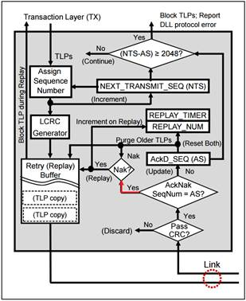

这里可以提一下计数器的一个潜在问题：理论上，发送的TLP数量可能远远大于接收方确认（返回Ack/Nak）的数量。如前所述，这种可能性很小，在此提及只是为了完备性。这个问题与流量控制计数器的问题基本相同（参见第234页，“第 3 阶段 - 计数器滚动”），也有相同的解决方案：NEXT_TRANSMIT_SEQ和ACKD_SEQ计数器之间的间隔绝不允许超过其总计数值的一半(译注：详见计数器滚动章节对2的补码描述，这种设计可以保证计数器回滚时规则的有效性)。如果发送了大量TLP却没有收到确认，以至于NEXT_TRANSMIT_SEQ计数值比ACKD_SEQ计数值晚2048个，那么发送方事务层将不再接受上层发来的更多TLP，直到收到更多Ack解决这一问题。如果发送的序列号与确认的次数之间的差值超过最大值的一半，则会报告数据链路层协议错误。(有关错误报告的更多信息，请参阅第 655 页 “数据链路层错误”）。

#### *10.2.1.7 DLLP CRC检查*

该模块检查DLLP的16位CRC（数据链路层的ECRC）是否有误。如果检测到错误，DLLP将被丢弃，如果启用，可能会报告“可纠正错误”。由于没有重传或错误纠正DLLP的机制，因此不会采取进一步措施。相反，我们只需等待下一次成功的Ack/Nak，这将使计数器恢复最新状态，并允许继续正常运行。

### 10.2.2 接收方要素

接收方首先检查传入的TLP是否有LCRC错误，然后检查序列号。如果没有错误，TLP将被转发到接收方的事务层。如果有错误，TLP将被丢弃，除非已经有一个Nak未处理，否则将安排一个Nak。

图10-5 展示了与处理入站TLP和出站Ack/Nak DLLP相关的接收方数据链路层要素。

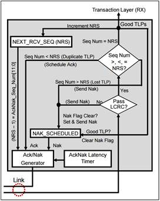

图10-5 Ack/Nak协议相关的接收方要素

#### *10.2.2.1 LCRC错误检查*

该模块通过验证32位LCRC，来检查接收到的TLP是否存在传输错误。该模块根据接收到的TLP比特计算LCRC值，然后将计算出的LCRC与接收到的LCRC进行比较。如果两者相匹配，则说明数据包的所有比特都已准确接收。如果不匹配，则说明TLP中存在比特错误，因此该数据包将被丢弃，并将发送Nak以获取该数据包的重传以及坏数据包之后发送的任何 TLP。

#### *10.2.2.2 NEXT_RCV_SEQ计数器*

12位NRS（NEXT_RCV_SEQ，下一个接收序列号）计数器跟踪预期序列号，用于验证数据包的接收是按照顺序的。复位时或数据链路层处于非活动状态时，计数器初始化为0。接收方每向事务层转发一个完好的TLP，计数器就递增一次。有错误或已作废的TLP不会发送到事务层，因此不会递增此计数器。

#### *10.2.2.3* *序列号检查*

如果LCRC检查无误，则根据预期计数（NRS编号）检查TLP的序列号。如图10-5所示，这种检查有三种可能的结果：

1、TLP序列号等于NRS计数（我们期待的数字）。在这种情况下，一切顺利：TLP 被接受并发送到事务层，NRS计数被递增。接收方计划发送Ack，但在AckNak_LATENCY_TIMER超时之前不必着急发送。在此期间，可能会收到其他好的TLP，从而使NEXT_RCV_SEQ计数器递增。然后，一旦AckNak_LATENCY_TIMER超时，就会发送一个带有最后收到的完好TLP的序列号（NRS-1）的Ack。这样，一个Ack就能代表多个成功的TLP，并减少了开销，因为每个TLP都不需要专门的Ack。

2、如果TLP的序列号早于NRS计数（小于预期值），则表示该TLP之前已出现过，是一个重复的TLP。只要预期的序列号和接收到的序列号相差不超过总计数值的一半（2048），这就不是错误，而是被视为重复，这意味着TLP在之前已经被接受过。在这种情况下，TLP 会被无声地丢弃（无Nak，无错误报告），接收方将发送带有最后收到的完好TLP的序列号（NRS-1）的Ack。为什么会出现这种情况？发送方可能没有收到已发送的Ack，导致其 REPLAY_TIMER已超时，并重新发送了重传Buffer中的所有内容。通过向发送方发送带有我们收到的最后一个完好数据包的序列号的Ack，我们就能通知他我们取得的最新进展。

3、如果TLP的序列号晚于NEXT_RCV_SEQ 的序列号（大于预期），则链路层漏掉了一个 TLP。例如，如果我们期待的序列号是30，而传入TLP的序列号是31，我们就知道出问题了。序列号必须是连续的，既然不是连续的，就一定有一个序列号失效并被丢弃（在物理层可能出现这种情况）。无论是否有其他错误，这个失序的TLP都会被丢弃，因为我们必须按顺序接受TLP。如果没有未完成的Nak，我们就会发送一个Nak。

预期序列号（NRS）随着新TLP的成功接收而递增的概念，以及它如何影响无效序列号范围（译注：接受的TLP序列号大/晚于NRS）和重复序列号范围（译注：接受的TLP序列号小/早于NRS）的滑动窗口，可参见图10-6。

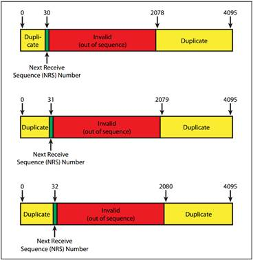

图10-6 序列号范围的示例

#### *10.2.2.4 NAK_SCHEDULED* *标志*

每当接收方发起Nak时，该标志就会被置位，当接收方成功接收到带有预期正确序列号（NRS）的TLP时，该标志就会被清零。规范明确规定，当NAK_SCHEDULED标志被设置时，接收方不得调度额外的Nak DLLP。笔者认为，这样做是为了防止出现无休止循环的可能性；在这种情况下，发送方开始重传一些数据包，但接收方在重传结束前又发送了一个Nak，导致发送方重新开始发送重传的数据包。无论动机如何，一旦发送了一个Nak，就不会再有Nak出现，直到成功收到带有正确序列号的重传TLP，问题才会得到解决。

#### *10.2.2.5 AckNak_LATENCY_TIMER 计时器*

当接收方成功接收TLP但尚未发送Ack/Nak时，该计时器即开始运行。计时器超时后，接收方必须发送Ack。AckNak_LATENCY_TIMER计时器的运行时长由规范决定（请参阅第328 页上的“AckNak_LATENCY_TIMER”），它决定了接收方可以合并Ack的时长。一旦AckNak延迟计时器超时，就会生成并发送序列号为NRS-1的Ack，表示最后收到的完好数据包。每当发送Ack或Nak时，该计时器都会重置，只有在收到新的完好TLP后才会重新启动。

#### *10.2.2.6 Ack/Nak* *发生器*

Ack或Nak DLLP由错误检查模块调度，包含一个12位AckNak_Seq_Num字段，如图10-7所示。它通过从NRS计数中减去1计算得出，从而代表着最后收到的完好序列号。这是因为收到的完好TLP会在调度Ack之前递增NRS，而失败的TLP只调度Nak而不递增NRS。（译注：举例，初始化完成后，Seq为0，NRS为0。假设发送方成功传输了1个TLP包，在接收方向事务层转发这1个收到的TLP后，NRS加1。然后接收方发送Ack包，则需要的发送的是NRS-1）这种方法更容易处理失败的数据包，因为TLP中的错误可能出在序列号上，所以不能在Nak中使用序列号。取而代之的是，它使用的是最后一个完好TLP的编号；也就是我们所期望的减一。该值不代表最后一个完好TLP的唯一情况是重置后的第一个TLP。如果使用序列号0的第一个TLP出现故障，生成的Nak值将是AckNak_Seq_Num值的0减1，结果为12位全部为1。

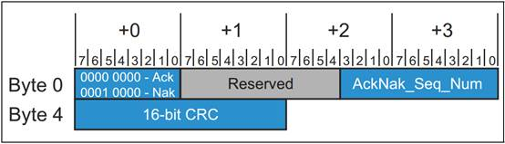

图10-7 Ack/Nak DLLP格式

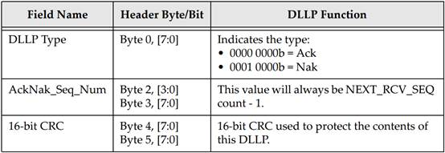

表10-1 Ack/Nak DLLP字段

## 10.3 Ack/Nak协议详情

本节将详细介绍发送方和接收方在处理TLP和Ack/Nak DLLP时的行为。本节将使用几个示例来演示可能出现的各种情况。

### 10.3.1 发送方协议详情

#### *10.3.1.1* *序列号*

回看图10-4，当TLP由事务层传送到链路层时，第一步是附加一个12位序列号。请注意，下一个序列号实际上可能会小于当前序列号，因为序列号计数器在达到最大值4095后会回滚至0。因此，例如，0的值实际上可能比4095的值“大”。可以将序列号之间的比较看作是评估一个持续向上移动和回滚的数字“窗口”。为了澄清这一概念，在接下来的几个示例中将使用这种回滚计数。

#### *10.3.1.2 32-bit LCRC*

发送方还根据TLP内容（序列号、报文头、数据有效载荷和 ECRC）生成并附加32位LCRC（链路 CRC）。

#### *10.3.1.3* *重传Buffer*

1、总体概括

设备在传输TLP之前，会在重传Buffer中存储一份TLP副本。(请注意，规范中使用的术语是Retry Buffer，但在本书中选择了“Replay”而不是“Retry”，以便更清楚地将这种机制与旧的PCI重试机制区分开来）。每个Buffer条目存储一个完整的TLP，其所有字段包括序列号（12位，占2个字节）、头（最多16个字节）、可选数据有效载荷（最多4KB）、可选ECRC（4个字节）和LCRC字段（4个字节）。

需要注意的是，规范以这种快速方式描述了重传Buffer，但规范并未要求必须以这种方式实现。只要您的设备能根据规范的规定，在需要时重传TLP序列，那么如何在设备中实现这一点完全取决于设计者。具有上述行为的重传缓冲器是实现这一目标的方法之一。

2、重传Buffer大小

规范编写者选择不指定重传Buffer的大小，而是将其作为设备设计者的优化选项。缓冲区应该足够大，以存储尚未被Acks确认的TLP，这样在正常工作条件下，缓冲区就不会满，也不会阻塞从事务层进入的新TLP。但缓冲区也应该足够小，以降低成本。要确定最佳缓冲区大小，设计人员需要考虑以下因素：

- 来自接收方的Ack DLLP延迟。

- 物理链路造成的延迟。

- 接收方从L0s退出到L0的延迟。换句话说，缓冲区应足够大，以便在链路从L0s状态返回L0时保持TLP而不停滞。

当发送方收到Ack时，它会从重传Buffer中清除序列号等于或早于Ack中序列号的TLP（通常情况下，这个术语应该是“小于”，但计数器的回滚行为有时会使其成为一个不正确的评估，因此选择了“早于 ”这个术语）。同样，发送方收到Nak时，仍会清除重传Buffer中序列号等于或早于Nak中序列号的TLP，但同时也会重传序列号较晚的 TLP（重传缓冲区中剩余的TLP）。

#### *10.3.1.4* *发送方对Ack DLLP的响应*

接收方返回的单个Ack可确认多个TLP；不必每个TLP都用一个专用的Ack表示收到。接收方可以收到多个良好的 TLP，并发送一个带有最后收到的完好TLP的序列号的Ack。发送方对向前推进的Ack（其序列号晚于发送方最后收到的序列号）的响应，是用新Ack的序列号加载AckD_SEQ寄存器。它还会重置REPLAY_NUM计数器和REPLAY_TIMER，并清除重传Buffer中被该Ack确认的所有TLP。

#### *10.3.1.5 Ack/Nak示例*

1、示例1，下面的讨论可以参考图10-8。

① 设备A发送序列号为3、4、5、6、7的TLP。

② 设备B成功接收到TLP 3，并将其NEXT_RCV_SEQ计数器从3增加到4。 由于设备B之前已确认所有成功接收到的TLP，因此AckNak_LATENCY_TIMER没有运行。在接收到TLP 3后，设备B现在已成功接收到一个它尚未确认的TLP，因此AckNak_LATENCY_TIMER开始运行（这相当于调度一次 Ack）。

③ 设备B在AckNak_LATENCY_TIMER超时之前成功接收TLP 4和5。接收 TLP 4 和 5 不会重置AckNak_LATENCY_TIMER。

④ AckNak_LATENCY_TIMER超时后，设备B发送一个序列号为5的 Ack，即最后接收到的完好TLP。AckNak_LATENCY_TIMER被重置，但在成功接收到TLP 6之前不会重新启动。

⑤ 设备A收到Ack 5，重置REPLAY_TIMER和REPLAY_NUM计数器，因为正在向前推进。它将清除重传Buffer中序列号早于或等于5的TLP。

⑥ 一旦设备B收到TLP 6和7且其AckNak_LATENCY_TIMER再次超时，它将发送序列号为7的Ack，从而清除设备A的重传Buffer中的最后两个TLP（根据本例）。

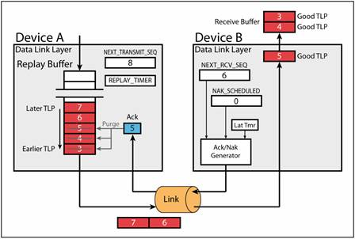

图10-8 示例1（关于Ack）

2、示例2，此示例显示了与示例1完全相同的行为，但它指出了序列号的翻转行为，如图10-9所示。

① 设备A发送序列号为4094、4095、0、1和2的TLP，其中TLP 4094是第一个发送的TLP，TLP 2是本例中最后一个发送的TLP。

② 设备B成功接收到序列号依次为4094、4095、0、1的TLP。接收TLP 4094会导致AckNak_LATENCY_TIMER启动。TLP 4095、0和1在AckNak_LATENCY_TIMER到期前收到。TLP 2仍在途中。

③ 由于AckNak_LATENCY_TIMER已超时，设备B发送序列号为1的Ack，确认收到TLP 1和之前的所有TLP（本例中为 0、4095和4094）。

④ 设备A成功收到Ack 1，从重传Buffer中清除TLP 4094、4095、0和1，并重置REPLAY_TIMER和REPLAY_NUM计数。

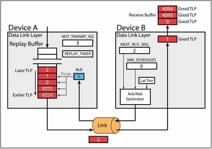

图10-9 示例2，带有序列号翻转的Ack

#### *10.3.1.6* *发送方对Nak DLLP响应*

Nak表示发生了问题。当发送方收到一个Nak时，它首先会从重传Buffer中清除序列号较早或相等的TLP，然后重传剩余的 TLP（从Nak中解析出的序列号之后的，所有仍在Buffer中的TLP包）。如果 Nak 导致至少一个TLP从Buffer中清除，那么我们就取得了进展。在这种情况下，发送方将重置REPLAY_NUM计数器和REPLAY_TIMER，并用Nak的序列号加载 AckD_SEQ寄存器。

#### *10.3.1.7 TLP重传*

当需要重传时，发送方会阻止接受来自其事务层的新TLP。然后，它会按照放入Buffer的相同顺序（就像一个FIFO）重传Buffer中的必要TLP。重传事件结束后，数据链路层会继续接收来自其事务层的新TLP。重传的TLP会保留在Buffer中，直到稍后被最终确认。

#### *10.3.1.8* *高效的TLP重传*

在重传期间收到的Ack或Nak DLLP必须被处理。因此，这里有两种主要选择：①发送方可以将它们保留到重传结束，然后评估Ack/Nak并采取适当措施。②另一种选择是在重传过程中就开始处理新的Ack/Nak DLLPs。如果使用此选项，新收到的Ack可能会在重传过程中清除Buffer中的某些条目，从而减少需要重传的TLP数量，节省链路时间。这种情况是允许的，但必须记住，TLP一旦开始传输，就必须完成。

#### *10.3.1.9 Nak示例*

请参考图10-10。

① 设备A发送序列号为4094、4095、0、1和2的TLP。

② 设备B无误接收TLP 4094，并将NEXT_RCV_SEQ计数递增到4095，同时启动AckNak_LATENCY_TIMER。

③ 设备B在收到的下一个TLP（TLP 4095）中检测到CRC错误，并设置NAK_SCHEDULED标志，这将导致发送序列号为4094（NEXT_RCV_SEQ计数-1）的Nak。设备B在发送Nak之前不会等待AckNak_LATENCY_TIMER超时。它通常会在下一个数据包边界发送。当面，由于Nak已计划发送，AckNak_LATENCY_TIMER将停止并复位。

④ 设备B将继续评估传入的TLP，寻找TLP 4095。然而，由于设备A还不知道有问题，它发送了数据包0、1和2，设备B将接收这些数据包。然而，设备B将不会接受这些数据包，即使它们可能是完好的TLP（即它们通过了LCRC检查）。这是因为必须按顺序接收所有数据包。因此，设备B会简单地丢弃这些数据包，因为它们被认为是不按顺序的，但不会发送额外的Nak。即使其中一个或多个TLP未通过LCRC检查，也不会发送额外的NAK。NAK_SCHEDULED标志已被设置，只有在设备B成功接收到它所期望的TLP（本例中为TLP 4095）后才会被清除。

⑤ 设备A接收到Nak 4094，并从重传Buffer中清除TLP 4094和更早的TLP（本例中没有）。此外，由于已向前推进，它将重置REPLAY_TIMER和REPLAY_NUM的计数。

⑥ 由于收到的确认DLLP是Nak而不是Ack，因此设备A会重传Buffer中的所有剩余TLP（TLP 4095、0、1和2），并重新启动REPLAY_TIMER，将REPLAY_NUM计数递增1。

⑦ 设备B收到重传的TLP 4095后，将清除NAK_SCHEDULED标记，递增NEXT_RCV_SEQ计数，并启动AckNak_LATENCY_TIMER。

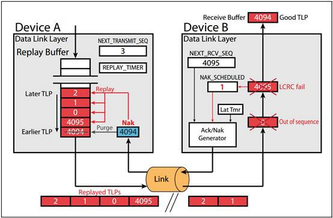

图10-10 Nak示例

#### *10.3.1.10 TLP的重复重传*

1、总体概括

发送方每次接收到Nak时，都会重新传输重传Buffer中的内容，并递增REPLAY_NUM计数器（此计数器为2比特），以跟踪重传事件的数量。上例中由Nak引起的重传将增加REPLAY_NUM。

如果重传不能解决问题，我们就会进入新的情况。接收方已设置了Nak Scheduled标志，在正确接收到违规TLP之前，接收方不能再发送任何Ack/Nak。如果重传由于某种原因没有把完好的TLP送至接收方，那么接收方将不会再有任何Ack/Nak的回应。现在，发送方的REPLAY_TIMER可以避免上述情况出现。当它超时时，重传Buffer的全部内容将被重传，REPLAY_NUM计数器将被递增，REPLAY_TIMER将被复位并重新启动。如果REPLAY_TIMER在超时时没有收到表示有更多进展的Ack/Nak，则此重传过程最多可重复三次。如果在第三次重传之后，仍然没有更多进展，并且REPLAY_TIMER再次超时，这将导致REPLAY_NUM计数器从3翻转回0。

2、重传次数回滚

出现这种情况时，可以假设链路出现了问题，因此链路层会触发物理层重新训练链路，使其进入恢复状态（请参阅第571页“恢复状态”）。如果执行了可选的高级错误报告寄存器，重传编号翻转错误状态位也将被置为1（“高级可纠正错误处理”参见第688页）。在重新训练链路的过程中，重传Buffer的内容将被保留，链路层也不会被初始化（这只是对链路进行重训，而不是对链路进行重置）。当重新训练完成后，发送方再次恢复相同的重传过程，期望现在问题已被清除，可以成功重传TLP。

该规范没有说明，如果链路训练不能清除问题，设备如何处理重复翻转事件。笔者曾见过一些市售硬件，它们没有检测这种情况的机制，只能陷入无休止的重新训练循环。因此，建议设备跟踪重新训练的尝试次数似乎是个不错的选择。在尝试足够多次后，设备可发出 “无法纠正的致命错误”信号或中断信号，以通知软件出现这种情况。

#### *10.3.1.11* *重传计时器（REPLAY_TIMER）*

发送方REPLAY_TIMER在TLP已发送但尚未确认的情况下运行。REPLAY_TIMER的目标是确保及时收到确认TLP送达的Ack/Nak。如果该计时器超时，一定是出现了什么问题，导致该时间点应该已经收到的Ack/Nak现在并没有收到。从发送方的角度来看，解决方法就是执行重传，即重新发送重传Buffer中的所有内容。

根据该计时器的用途，其超时值应与接收方中的AckNak_LATENCY_TIMER相关。事实上，REPLAY_TIMER是比AckNak_LATENCY_TIMER长了三倍。

PCIe规范中的一个公式（见下方第1点）决定了计时器REPLAY_TIMER的计数值，此计时器超时会触发重传事件，并递增REPLAY_NUM计数器。可能出现超时的几种情况是：Ack/Nak在途中丢失，或者接收方出错导致无法返回Ack/Nak。以下是REPLAY_TIMER的相关规则：

- 如果计时器尚未运行，则在传输任何TLP的最后一个符号时开始计时。 

- 计时器在以下情况下复位并重新启动 
  - 收到Ack（这指示接收方取得了进展），**并且**重传Buffer中仍有未收到确认的TLP
  - 发生重传事件，第一个重传TLP的最后一个符号被发送

- 在下列情况下复位并保持计时器 
  - 没有TLP要发送，或者重传缓冲区为空 
  - 收到一个Nak。当第一个重传TLP的最后一个符号被发送时，计时器重新启动。
  - 计时器超时。当第一个重传TLP的最后一个符号被发送时，计时器重新启动。
  - 数据链路层处于非活动状态

- 计时器在链路训练或再训练期间保持不变

1、重传计时器计算公式

超时值主要取决于最大数据有效载荷和链路宽度。以符号时间为单位计算REPLAY_TIMER值的公式如下。请注意，该值是AckNak_LATENCY_TIMER值的三倍。

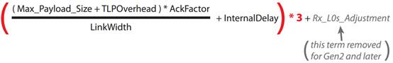

等式字段定义如下：

- Max_Payload_Size：设备控制寄存器中的值。如果多个function的Max_Payload_Size值不同，规范建议使用其中最小的一个。

- TLP开销：数据有效载荷之外的额外TLP字段（序列号、报头、摘要、LCRC和开始/结束帧符号）。在规范中，开销值被视为28个符号的常数。

- AckFactor(AF)：基本上是一个模糊系数，表示在必须发送Ack之前可接收的最大有效载荷大小的TLP数量。AF值从1.0到3.0不等，旨在平衡链路带宽效率和重传Buffer大小。图10-11中的表格显示了不同链路宽度和有效负载大小的AckFactor值。选择这些AckFactor值的目的是在实现良好的性能的同时，不需要使用太大且不经济的重传Buffer。

- LinkWidth：范围从x1（1位宽）到x32（32位宽）。

- InternalDelay：接收方处理TLP和发送方处理DLLP（Acks）的内部延迟。该值在规范中以符号时间定义，取决于链路速度：Gen1=19，Gen2=70，Gen3=115。

- Rx_L0s_Adjustment：这个值包含在1.x PCIe规范中，但在2.0及以后的PCIe规范中被取消。它可用于计算接收电路从L0s退出到L0所需的时间。设置链路控制寄存器的 “扩展同步”位会影响从L0s退出的时间，因此在调整时必须考虑到这一点。有趣的是，规范编写者在创建重传计时器值表时将其假定为零。下文将对此进行详细介绍。

2、重传计时器汇总表

图10-11是Gen1速率的重传计时器汇总表，显示了REPLAY_TIMER公式中不同变量值的计时器负载值。新版本规范的数字有所变化，新表格及其讨论可参见第350页的“新版本规范的定时差异”部分。所有表格值的公差为-0%至+100%。

请注意，规范中的表值（为方便起见在此复制）之所以被称为“未调整（unadjusted）”，是因为它们忽略了等式中涉及从L0s恢复时间的最后一项。规范中没有对此作出解释，但如果链路必须从L0s唤醒到L0，以便重传一个数据包，在这种情况下计时器可能已经超时报错。这是一种糟糕的电源管理方式。

完全避免这一问题的一个简单方法是，发送方在进入L0s之前确保重传Buffer为空。规范要求进入L1时必须执行这一步骤，但进入L0s时却不需要，原因可能与涉及的相对风险有关。进入L1需要一个较长的恢复过程才能回到L0，而这个过程存在一定的失败风险。如果恢复失败，物理层状态机将不得不进行更多的链路训练，这个过程会清除链路层的LinkUp 标志，导致链路层重新初始化。如果此时重传Buffer中存在条目，它们就会丢失，从而导致问题。显然，L0s的恢复风险相比L1较低，一般不足以触发Buffer的丢失。不过，建表时还是没有考虑L0s延迟，让读者对此产生疑问。笔者认为，规范编写者希望设计人员采取措施，确保重传计时器超时不会在L0s阶段发生（在进入L0s阶段前清空重传Buffer），或者在观察到Acks的路径处于L0s阶段时延迟计时器的超时。

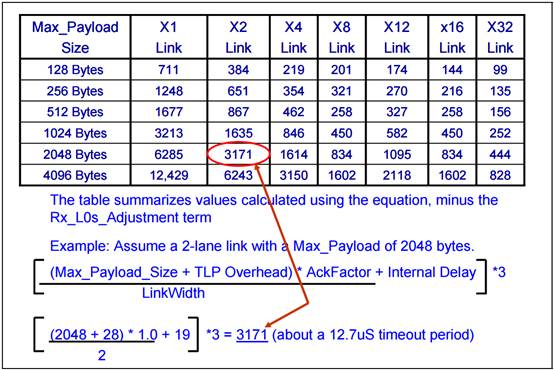

图10-11 Gen1未调整的重传计时器值

#### *10.3.1.12* *发送方DLLP处理*

Ack/Nak错误检查模块确定接收到的DLLP的16位CRC是否有错误。如果检测到错误，则丢弃DLLP。这被认为是一个可纠正的错误，可以设置为在可选的高级错误报告寄存器中报告（请参阅第 688 页“高级可纠正错误处理”中的损坏DLLP），但不会采取进一步措施，因为这并不是一个真正的问题。下一个成功接收的该类型DLLP将使计数器恢复正常。因此TLP的清除时间可能会稍晚一些，或者重传可能会在晚些时候发生，但不会丢失任何信息。当然，如果成功Acks之间的延迟时间过长，REPLAY_TIMER可能会超时，导致TLP被重传。

### 10.3.2接收方协议详情

#### *10.3.2.1* *物理层*

TLP被物理层接收后要检查是否出错（如组帧、不一致性和无效符号）。如果在这一层出现错误，TLP将被丢弃，链路层可能会通过某种特定的设计方法得到通知，以便安排Nak并重放数据包。如果不通知链路层，那么它最终会检测到序列号违规，从而导致Nak和重传。

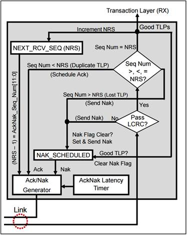

图10-12 Ack/Nak接收方元素

#### *10.3.2.2 TLP LCRC检查*

如果没有物理层错误，链路层首先检查是否有CRC错误。接收方从收到的TLP（不包括 LCRC字段）中计算出预期的LCRC值，并将该值与TLP中的32位LCRC进行比较。如果两者匹配，则TLP正常。否则，TLP将被丢弃，接收方将安排发送Nak。

#### *10.3.2.3* *下一个接收的TLP的序列号*

如果LCRC是正确的，接收方接下来会将NEXT_RCV_SEQ计数器与新接收的TLP中的序列号进行比较。在正常运行条件下，这两个数字会匹配（相等）。如果匹配，接收方就会将TLP转发到事务层，递增NEXT_RCV_SEQ计数器，并安排一次Ack。

如果接收到的TLP序列号早于或晚于NEXT_RCV_SEQ计数，就会出现两种情况之一：TLP重复或TLP序列错误。

1、TLP重复：如果传入数据包的序列号（Sequence Number）比预期值早（逻辑上较小），则表示发送方重新发送了接收方已经看到过的数据包。虽然重传数据包会浪费链路时间，但这一重传数据包并不是错误。这可能是发送方没有在计时器超时前收到前一个TLP的 Ack/Nak造成的。当接收方发现这种情况时，就会丢弃重复数据包，并用接收到的最后一个完好TLP的序列号（可能与重传TLP 中的序列号不同）安排Ack。

2、TLP序列错误：如果传入数据包的序列号晚于（逻辑上大于）预期值，唯一的解释就是TLP丢失了。这是一个可纠正的错误，可通过发送Nak来解决。接收到的数据包是否正确并不重要，因为我们关心的是按照正确的序列号顺序接收数据包。此序列错误的数据包将被丢弃，接收方会等待具有预期序列号的TLP。

当接收到的TLP出现CRC错误、无效或序列号检查失败时，NEXT_RCV_SEQ计数器不会递增。

发送方根据PCI排序规则对TLP排序，以保持正确的程序流程，避免潜在的死锁和活锁情况（参见第285 页，标题为“事务排序”的第8章）。接收方必须保持这种顺序，并应用这三条规则：

- 当接收方检测到一个坏的TLP时，它会丢弃该TLP和管线中的所有新TLP，直到检测到重传的TLP。

- 重复的TLP会被丢弃。

- 在等待丢失或损坏的TLP期间收到的TLP将被丢弃。

#### *10.3.2.4* *接收方安排一个Ack DLLP*

如果接收方的数据链路层没有检测到传入TLP中的错误，它就会将TLP转发给事务层。NEXT_RCV_SEQ计数器递增，接收方启动AckNak_LATENCY_TIMER（假设它尚未运行）。这相当于“安排了一个Ack”。在AckNak_LATENCY_TIMER超时之前，接收方可以继续接收良好的TLP而不发送Ack。计时器超时后，接收方只会发送一个带有最后一个良好TLP序列号的Ack，确认收到了当前Ack中序列号之前的所有良好TLP。这种技术通过减少Ack/Nak流量提高了链路效率。回顾一下，这种技术之所以有效，是因为TLP必须始终按顺序成功接收。

#### 10.3.2.5 *接收方安排一个Nak*

正如前面在讨论接收方逻辑时所提到的（见第324页“接收方要素”），当接收方检测到TLP上的错误时，它会丢弃坏数据包，并设置NAK_SCHEDULED标志（在该标志为清零的状态下），这将导致安排一个Nak，其序列号为NEXT_RCV_SEQ-1。由于Nak已被调度，AckNak_LATENCY_TIMER被复位并停止计时。可以将调度Nak视为“边沿触发”事件，而不是电平触发事件。NAK_SCHEDULED信号标志的上升沿会导致Nak被调度。直到下一个上升沿，才能发送另一个Nak，这意味着想发送更多的Nak必须先清除NAK_SCHEDULED信号标志（下降沿）。只有两个事件会清除NAK_SCHEDULED信号标志。第一个事件是成功接收到预期的下一个TLP（TLP的序列号与NEXT_RCV_SEQ计数相匹配）。第二个事件是链路复位（不是重新训练，而是复位）。

虽然将Nak快速地发送给发送方很重要（在接收到无误的故障TLP之前，接收方不能接收其他TLP），但当有其他已经发送出去（或优先级比Nak更高）的TLP、DLLP或有序集，此时接收方必须推迟Nak的发送，直到它们完成（请参阅第350页“建议的数据包优先级”）。在此期间，如果有其他TLP到达接收方，它们就会被丢弃掉。在NAK_SCHEDULED信号标志有效期间，不会再安排发送其他Ack/Nak。

#### *10.3.2.6 AckNak_LATENCY_TIMER计时器*

该计时器定义了接收方必须等待多长时间才能为成功接收的TLP（或TLP序列）发送Ack。如前所述，只要接收方成功接收到尚未确认的TLP，该计时器就会运行。一旦计时器超时，就会安排发送Ack，其序列号为接收方最后收到的完好TLP的序列号。安排Ack时会重置 AckNak_LATENCY_TIMER，只有在成功接收到下一个TLP后才会重新开始计数。

1、AckNak_LATENCY_TIMER公式

AckNak_LATENCY_TIMER 的超时值由规范定义，并根据已启用的协商链路宽度和最大有效载荷大小而变化。定义超时的公式如下所示：

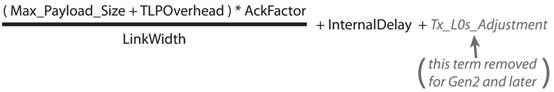

计时器中的值以符号时间（symbol times）为单位，即在链路上发送一个符号所需的时间： Gen1为4ns，Gen2为2ns，Gen3为1ns。

方程中相关字段为：

- Max_Payload_Size：设备控制寄存器中的值。如果多个功能的Max_Payload_Size值不同，规范建议使用其中最小的一个。

- TLPOverhead：数据有效载荷之外的额外TLP字段（序列号、报头、摘要、LCRC和开始/结束组帧符号）。在规范中，开销值被视为28个符号的常数。

- AckFactor(AF) ：基本上是一个模糊系数，表示在必须发送Ack之前可接收的最大有效载荷大小的TLP数量。AF值从1.0到3.0不等，旨在平衡链路带宽效率和重传Buffer大小。图10-11中的表格显示了不同链路宽度和有效负载大小的Ack因子值。选择这些AckFactor值的目的是在实现良好的性能的同时，不需要使用太大且不经济的重传Buffer。

- LinkWidth：范围从x1（1位宽）到x32（32位宽）。

- InternalDelay：接收方处理TLP和发送方处理DLLP（Acks）的内部延迟。该值在规范中以符号时间定义，取决于链路速度：Gen1=19，Gen2=70，Gen3=115。

- Tx_L0s_Adjustment：发送方L0s调整。这是一个包含在1.x PCIe规范中的值，但在2.0及以后的PCIe规范中被取消。它可用于计算接收电路从L0s退出到L0所需的时间。设置链路控制寄存器的“扩展同步”位会影响从L0s退出的时间，因此在调整时必须考虑到这一点。有趣的是，规范编写者在创建重传计时器（Replay Timer）值表时却将其假定为零。

2、AckNak_LATENCY_TIMER 汇总表

表10-2展示了AckNak_LATENCY_TIMER公式中使用的所有可能值的Gen1计时器负载值。更高的数据速率会改变等式和结果表（请参阅第350页上的“较新规范版本的定时差异”）。与重传计时器表一样，该表的结构也是假定等式中的发送方L0s调整为零，然后将结果值称为“未调整”。请注意，表中所有值的容差为-0%至+100%。

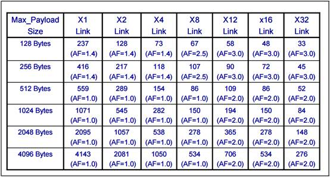

表10-2 Gen1速率未调整的Ack传输延迟

## 10.4 更多示例

在教学中，举例说明往往更容易让人理解Ack/Nak过程，因此在此列举一些例子来说明特殊情况。

### 10.4.1 丢失TLP

参见图10-13，图中展示了如何检测和处理丢失的TLP。

① 设备A发送TLP 4094、4095、0、1和2。

② 设备B成功接收TLP 4094，因此启动AckNak_LATENCY_TIMER，并递增NEXT_RCV_SEQ计数器。之后，它还接收到TLP 4095和0。

③ 接收到TLP 0后，AckNak_LATENCY_TIMER超时，这将导致设备B安排一次序列号为0的Ack。

④ 看到Ack 0，设备A会从重传Buffer中清除TLP 4094、4095和0。

⑤ 由于某种原因，TLP 1在途中丢失（可能是物理层丢弃了它），而TLP 2到达了。序列号检查告诉设备B，TLP 2的序列号不等于NEXT_RCV_SEQ计数器，大于了序列范围。

⑥ 设备B丢弃TLP 2并设置NAK_SCHEDULED信号标志，在这种情况下将发送Nak 0（NEXT_RCV_SEQ-1）。

⑦ 收到Nak 0 后，设备A重传TLP 1和2。它将清除重传Buffer中的TLP 0和任何先前的TLP，但这些TLP已被删除（在步骤4中），因此没有必要这样做。

⑧ TLP 1和2顺利到达设备B，并被转发到事务层。

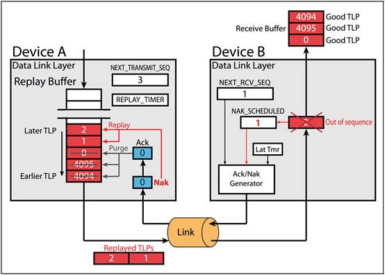

图10-13 处理丢失的TLP

### 10.4.2 损坏的Ack

图10-14展示了处理损坏的Ack的方法。

① 设备A发送TLP 4094、4095、0、1和2。

② 设备B收到TLP 4094、4095和0，将NEXT_RCV_SEQ设为1，并返回Ack 0，因为 AckNak_LATENCY_TIMER已超时。

③ Ack 0在链路上传输期间有一位翻转，因此当设备A检查16位CRC时，Ack 0检查失败并被丢弃。这意味着TLP 4094、4095和0仍保留在设备A的重传Buffer中。

④ TLP 1和2正常到达设备B，因此NEXT_RCV_SEQ计数递增到3，一旦AckNak_LATENCY_TIMER再次超时，将返回Ack 2。

⑤ Ack 2安全到达设备A，设备A清除其重传Buffer中的TLP 4094、4095、0、1和2。

如果Ack 2也丢失或损坏，且没有其他Ack/Nak DLLP返回设备A，则设备A的REPLAY_TIMER会超时，导致设备A重传整个Buffer。设备B收到TLP 4094、4095、0、1和2后认为它们是重复的（它们的序列号早于NEXT_RCV_SEQ计数器的值，此时值为3）。由于数据包重复，设备B将丢弃这些数据包并向设备A发送一个Ack 2。

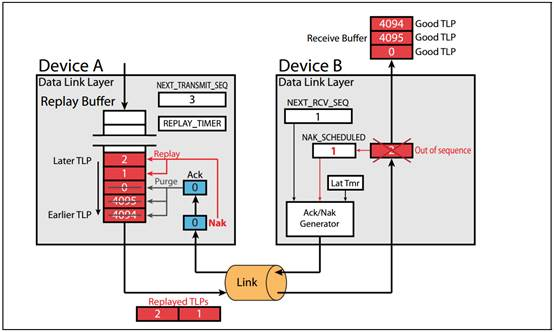

图10-14 处理损坏的Ack

### 10.4.3 损坏的Nak

图10-15展示了处理损坏的Nak的方法。

① 设备A发送TLP 4094、4095、0、1和2。

② 设备B成功接收TLP 4094、4095和0（且AckNak_LATENCY_TIMER尚未超时）。设备B收到的下一个TLP（TLP 1）未通过LCRC检查，因此设备B设置NAK_SCHEDULED信号标志，并复位住AckNak_LATENCY_TIMER。Nak将以最后接收到的完好TLP的序列号0发送回去。

③ Nak 0未通过设备A的16位CRC校验并被丢弃。

④ 此时，设备B将不再发送Ack/Nak，直到它成功接收到它期待的下一个TLP（本例中为TLP 1）。然而，这需要重传。设备A还不知道需要重传，因为发回的一个Nak已损坏并被丢弃。REPLAY_TIMER解决了这一问题。REPLAY_TIMER最终会超时，因为它在指定的时间内没有收到向前推进的Ack/Nak。

⑤ 一旦REPLAY_TIMER过期，设备A将重传存在Buffer中的所有TLP，递增REPLAY_NUM计数器，并复位和重新启动REPLAY_TIMER计数器。

⑥ 设备B将收到TLP 4094、4095和0，并发现它们是重复的。重复的TLP将被丢弃，设备B将安排一个序列号为0的Ack（表示取得的最新进展）。

⑦ 一旦设备B成功接收到TLP 1，它将清除NAK_SCHEDULED信号标志，递增NEXT_RCV_SEQ，并重新启动AckNak_LATENCY_TIMER，因为它已成功接收到一个尚未确认的TLP。

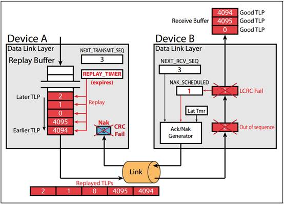

图10-15 处理损坏的Nak

## 10.5 Ack/Nak处理的错误情况

TLP在传输中可能出错，Ack/Nak协议保证了TLP的可靠传输。下面列出了在遇到TLP错误时解决的机制。

1、TLP中的LCRC错误。解决方法：接收方检测到LCRC错误，并安排一个包含NEXT_RCV_SEQ-1的Nak。作为回应，发送方从失败的TLP开始，重传至少一个TLP。

2、在发送到接收方数据链路层途中丢失的TLP（比如物理层检测到数据包有问题并丢弃）。解决办法：接收方检查所有接收到的TLP的序列号，希望下一个到达的TLP序列号符合预期。如果一个TLP丢失，下一个成功接收的TLP的序列号将不按顺序排列。作为回应，接收方会安排一个NEXT_RCV_SEQ-1的Nak，发送方则从丢失的TLP开始，至少重传一个 TLP。

3、在接收方发送给发送方的途中损坏的Ack/Nak。解决方案：发送方检测到DLLP中的CRC错误（请参阅第309 页“接收方处理DLLP”），丢弃并等待下一个数据包。

- Ack的情况：随后收到序列号较晚的Ack，会导致发送方清除重传Buffer中所有序列号等于或早于它的TLP。发送方并不会意识到出现了什么问题（除了重传Buffer中可能暂时填满的情况）。

- Nak的情况：接收方设置了Nak Scheduled标志，在成功接收到下一个预期TLP之前，不会再发送Nak或任何Acks，这意味着需要重传。当然，如果Nak丢失，发送方也不知道需要重传。在这种情况下，发送方的REPLAY_TIMER最终会超时并触发重传。

4、在预期时间内未收到Ack/Nak。解决方案：REPLAY_TIMER超时触发重传。

5、接收方未能为收到的TLP发送Ack/Nak。解决办法：同样，发送方的REPLAY_TIMER会超时并导致重传。

## 10.6 数据包的推荐优先级

设备可能有多种类型的TLP、DLLP和有序集要在给定链路上传输。建议调度数据包的优先级为：

1、完成当前正在进行的任何TLP或DLLP（最高优先级） 

2、有序集

3、Nak

4、Ack

5、流量控制

6、重传Buffer的重传

7、在事务层等待的TLP

8、所有其他DLLP传输（最低优先级）

## 10.7 较新规范版本的定时器差异

如前所述，Ack/Nak协议的定时器值在Gen2和更新版本的规范中有所不同。为了提高文本的可读性，前面的讨论只包括Gen1版本（2.5 GT/s速率），但为了方便起见，这里包括了所有三个版本。

和以前一样，给出的值是符号时间（symbol time），因此实际时间是该值乘以该速率在链路上传输一个符号所需的时间。例如，传输一个符号的时间（称为符号时间），Gen1为4ns，Gen2为2ns，Gen3为1.25ns。

### 10.7.1 Ack传输延迟（AckNak延迟）

规范版本之间的一个有趣区别是L0s恢复时间的考虑方式。在1.x规范中，AckNak_LATENCY_TIMER公式中包含了一个参数来考虑这一因素，但规范中基于该等式的表格却将其值设为零，并将所得值称为“未调整”值。从2.0规范开始，等式中的L0s恢复值被完全删除，文中指出接收器无需根据L0s退出延迟或扩展同步位的值调整Ack调度。表中的值都不包含L0s恢复部分，因此仍称为“未调整”。

需要注意的是，由于所有表格中的AF（Ack Factor）值都是一样的，而且在之前的Gen1 表格中也有显示，因此这里的表格中不包括这些值。

此外，与Gen1一样，所有表格值的容差为-0%至+100%。为了说明这一点，表10-3列出的x1链路和最大有效载荷为128字节的符号时间为237。因此，合法值的范围为不小于237符号时间，到不大于474符号时间。

#### *10.7.1.1* *运行在2.5 GT/s*

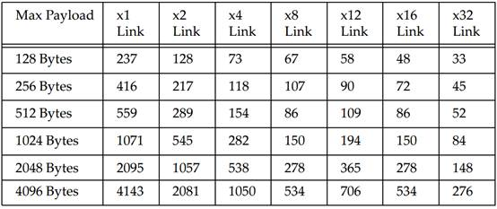

表10-3 Gen1未调整的AckNak_LATENCY_TIMER值（符号时间）

#### *10.7.1.2* *运行在5.0 GT/s*

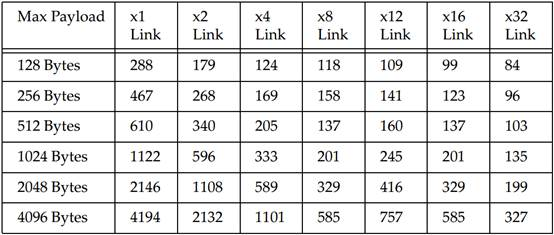

表10-4 Gen2未调整的AckNak_LATENCY_TIMER值（符号时间）

#### *10.7.1.3* *运行在8.0 GT/s*

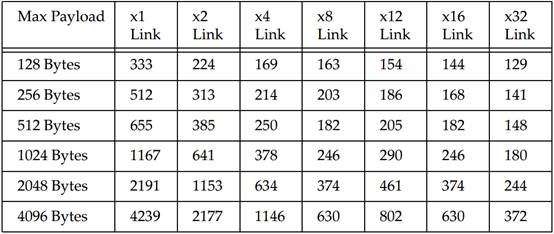

表10-5 Gen3未调整的AckNak_LATENCY_TIMER值（符号时间）

### 10.7.2 重传计时器（Replay Timer）

与AckNak延迟计时器的计算方法类似，在较新的规范版本中，重传计时器对L0s恢复时间的考虑也有所不同。在1.x规范中，“重传计时器”公式中包含了一个参数来说明这一点，但规范中基于该等式的表格将其值设为零，并将结果值称为“未调整”。从2.0规范开始，公式中完全去掉了这个参数。前文指出，如果要从L0s退出，发送方应补偿L0s退出时间，方法是在表值中静态添加该时间。或者，发送方应该感知链路何时处于该状态，并在这种情况下留出额外时间。表值仍不包含L0s部分，仍称为“未调整”。

最后，规范强烈建议，如果接收Ack的延迟可能是由于其他设备的发送方处于L0s状态造成的，则发送方不应在重传计时器超时的时候进行重传。

请注意，与AckNak延迟计时器表一样，所有表值的容差为-0%至+100%。为了说明这一点，表10-6列出的x1链路和最大有效载荷为128字节的符号时间为711。因此，合法值的范围为不小于711符号时间，到不大于1422符号时间。

#### *10.7.2.1* *运行在2.5 GT/s*

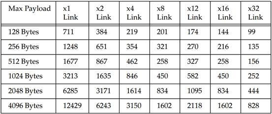

表10-6 Gen1未调整的REPLAY_TIMER值（符号时间）

#### *10.7.2.2* *运行在5.0 GT/s*

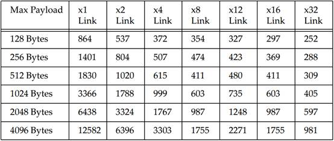

表10-7 Gen2未调整的REPLAY_TIMER值（符号时间）

#### *10.7.2.3* *运行在8.0 GT/s*

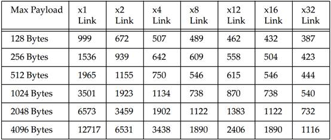

表10-8 Gen3未调整的REPLAY_TIMER值（符号时间）

## 10.8 Switch直通模式

既然我们已经介绍了协议的工作原理，现在正是解释例外情况的好时机。PCIe支持一种名为“直通模式”的交换机功能，可用于改善大型TLP通过交换机的传输延迟。

### 10.8.1 背景

考虑一个例子，如图10-16所示，一个大型TLP需要通过交换机。由于交换机的入口端口在接收到完整的TLP之前无法判断数据包中是否有错误，因此它通常会存储整个数据包，并在将其转发到出口端口之前检查是否有错误。这种存储转发方法虽然有效，但对于大型数据包来说，通过交换机的延迟可能会很大，这对某些应用来说可能是个问题。如果可能，最好能尽量减少这种延迟。

### 10.8.2 一个改进延迟的选项

由于TLP的第一部分包含有数据包路由信息的报头，因此一种选择是假定数据包是一个好数据包，甚至在收到整个数据包之前就开始评估报头中的路由信息。这样，交换机就能在路由评估完成后立即开始将TLP转发到出口端口。然后，只要这样做不会导致交换机内出现下溢情况，出口端口就可以开始将其发送到其链路上。(如果入口端口为x1，而输出端口为x16，则很容易出现潜在的下溢情况。出口端口发送数据包的速度将远远快于接收数据包的速度）。

当然，入口端口在收到数据包末尾的LCRC之前无法检查数据包中是否有错误，因此转发出去的TLP可能实际上包含错误，这将导致风险。TLP的末端终将到达入口端口，此时数据包可以被检查。如果发现有错误，入口端口就会按照正常方式处理错误TLP，并发送Nak以重传数据包。但是，现在必须解决的问题是，这个损坏数据包的大部分内容已经转发到了出口端口。这时我们有什么选择呢？我们可以完成数据包的转发，然后等待相邻的接收方发现错误后发出Nak，但重传Buffer中的数据包将是损坏的数据包，因此重传并不能解决问题。我们可以在传输中截断损坏的数据包，但规范不允许这种可能性。要实现这一点，我们需要另一种选择，这就是直通（Cut-Through）选项发挥作用的地方。

### 10.8.3 直通操作

直通模式为上一节所述的转发问题提供了解决方案：如果在正在接收的数据包中发现错误，则必须使已在发送途中的数据包“无效”。

无效数据包以EDB（end bad）符号而不是END（end good）符号结束，为了使条件非常清楚，TLP的32位LCRC将从原始计算值反转（1的补码）。从本质上讲，无效数据包就像从未存在过一样被处理。在交换机的出口端口，重传Buffer会丢弃该数据包，NEXT_TRANSMIT_SEQ计数器会减1（回滚）。

当设备接收到被其识别为无效TLP的TLP时，它会简单地丢弃数据包，并将其视为从未存在过。NEXT_RCV_SEQ不会递增，AckNak_LATENCY_TIMER不会启动，NAK_SCHEDULED也不会设置。接收设备会静默地丢弃作废的TLP，并且不会为此返回Ack/Nak。

### 10.8.4 直通操作示例

图10-16 展示了一个TLP从左边进入，经过交换机，最后到达右边的EP。左侧链路出现TLP错误。过程如下： 

① 在交换机入口端口接收到一个传入的TLP。该TLP在传输过程中损坏，但目前设备尚不清楚。

② TLP报头到达并解码，数据包以直通方式转发到目的地出口端口。

③ 最终，数据包的末端到达，交换机入口端口能够完成LCRC错误检查。它会发现一个CRC错误，并向TLP源返回一个Nak。

④ 在出口端口，交换机用EDB取代坏TLP末尾的END组帧符号，并反转计算出的LCRC 值。TLP现在被设置为“无效”，交换机将其从重传Buffer中丢弃。

⑤ 无效数据包到达EP。EP检测到EDB符号和倒置的LCRC，并默默地丢弃数据包。它不会返回Nak。

现在，假设TLP源设备重传了数据包，并且没有发生错误。和以前一样，TLP会以极短的延迟转发到出口端口。当TLP的其余部分到达交换机时，没有发生错误，因此会向TLP源设备返回一个Ack，然后将此TLP从原设备的重传Buffer中清除。这时，交换机出口端口会在其重传Buffer中保留一份TLP副本。当TLP到达目的地时，数据包没有错误，EP返回Ack。在此基础上，交换机从其重传Buffer中清除TLP副本，传输序列完成。

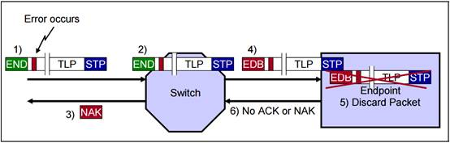

图10-16 交换机直通模式的错误处理

------

原文： Mindshare

译者： huimin1000

校对:	

欢迎参与 《Mindshare PCI Express Technology 3.0 一书的中文翻译计划》

https://gitee.com/ljgibbs/chinese-translation-of-pci-express-technology